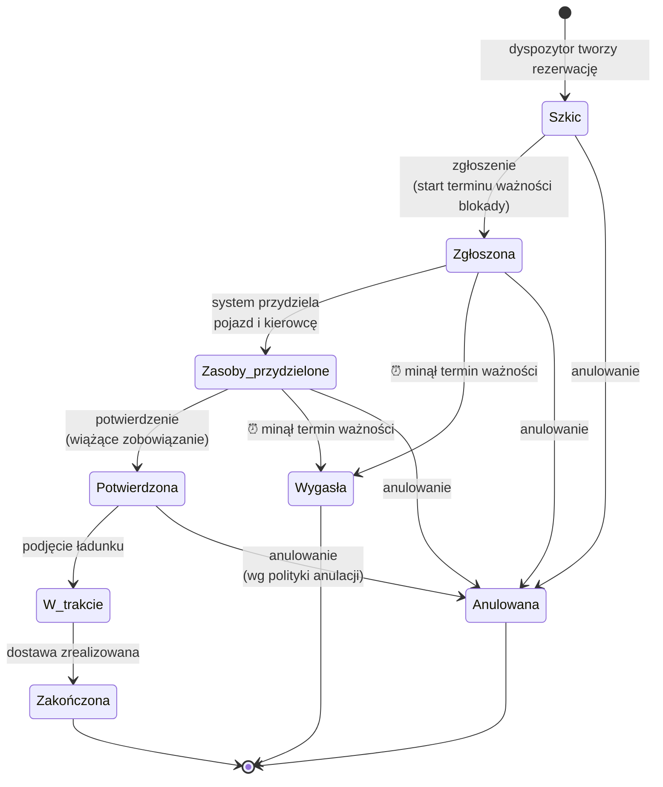
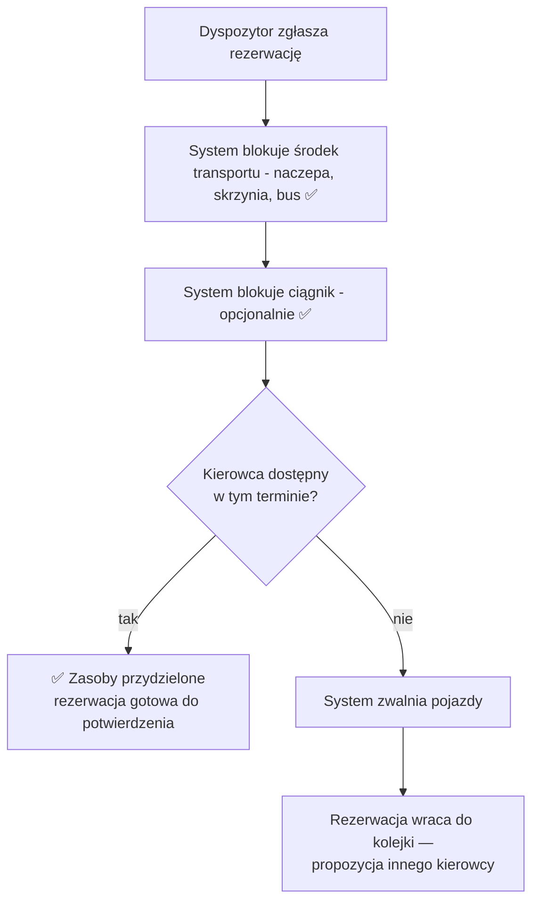

# Rezerwacja transportu — przegląd dla biznesu

> Propozycja nowej funkcji w systemie TMS: **rezerwowanie pojazdów i kierowców pod konkretne zamówienia transportowe**.
> Wersja uproszczona do dyskusji z interesariuszami — szczegóły techniczne w osobnym dokumencie projektowym.

---

## 1. Jaki problem rozwiązujemy?

Zamówienie transportowe to **obietnica złożona klientowi**: dostarczymy ładunek na czas. Żeby tę obietnicę spełnić, musimy z wyprzedzeniem zapewnić sobie:

- **pojazd** — odpowiedni do ładunku (zestaw ciągnik + naczepa albo pojedynczy van / solówka),
- **kierowcę** — z uprawnieniami do prowadzenia tego pojazdu,
- **termin** — okno czasowe od odbioru do dostawy.

**Dziś system tego nie robi.** Nie ma mechanizmu, który „odkłada” pojazd i kierowcę pod zamówienie. W efekcie:

- ten sam pojazd może zostać obiecany dwóm klientom naraz,
- dopiero w dniu wyjazdu okazuje się, że brakuje kierowcy z odpowiednimi uprawnieniami,
- plan załadunku istnieje w oderwaniu od realnych zasobów i terminów.

**Rozwiązanie:** wprowadzamy **rezerwację transportu** — działa jak rezerwacja hotelowa: najpierw wstępna blokada z terminem ważności, potem wiążące potwierdzenie.

---

## 2. Kluczowe pojęcia

| Pojęcie | Co to znaczy w praktyce |
|---|---|
| **Rezerwacja transportu** | „Zaklepanie” pojazdu, kierowcy i terminu pod konkretne zamówienie klienta. |
| **Wstępna blokada (hold)** | Tymczasowe odłożenie zasobów — jak koszyk w sklepie internetowym. Ma termin ważności: jeśli rezerwacja nie zostanie potwierdzona na czas, blokada **wygasa automatycznie**, a zasoby wracają do puli. |
| **Kalendarz zasobu** | Każdy pojazd i każdy kierowca ma swój kalendarz zajętości. To on pilnuje, żeby **nikt nie zarezerwował tego samego zasobu dwa razy** na nakładające się terminy. |
| **Profil ładunku** | Zapis wymagań ładunku w chwili rezerwacji: waga, wymiary, typ (np. chłodnia, materiały niebezpieczne). Dzięki temu zawsze wiadomo, **pod co dokładnie** zablokowaliśmy zasoby. |

---

## 3. Jak przebiega rezerwacja? (cykl życia)

W skrócie — rezerwacja przechodzi przez kolejne etapy:

1. **Szkic** — dyspozytor przygotowuje rezerwację, nic nie jest jeszcze blokowane.
2. **Zgłoszona** — rusza zegar: rezerwacja ma określony czas na domknięcie, zanim wygaśnie.
3. **Zasoby przydzielone** — konkretny pojazd i kierowca są wstępnie zablokowani w kalendarzach.
4. **Potwierdzona** — wiążące zobowiązanie: zasoby zablokowane „na twardo”, zmiany tylko przez anulowanie.
5. **W trakcie → Zakończona** — realizacja przewozu.

Dodatkowo rezerwacja może **wygasnąć** (nikt jej nie potwierdził na czas — zasoby automatycznie wracają do puli) albo zostać **anulowana** (decyzją człowieka).

---

## 4. Jakich zasad pilnuje system?

System automatycznie egzekwuje reguły, które dziś opierają się na uwadze i pamięci ludzi:

**Terminy i dostępność**
- Termin odbioru musi być wcześniejszy niż termin dostawy; nie da się rezerwować „wstecz”.
- **Żaden pojazd ani kierowca nie może mieć dwóch rezerwacji na nakładające się terminy** — to najważniejsza zasada, chroniona podwójnie (przez logikę systemu i przez bazę danych).

**Dopasowanie zasobów do ładunku**
- Zestaw musi być kompletny: ciągnik + naczepa razem, albo pojedynczy van / solówka — nigdy „połowa zestawu”.
- Typ pojazdu musi pasować do ładunku: chłodnia dla towaru chłodzonego, odpowiednia ładowność i wymiary.

**Ludzie i dokumenty**
- Kierowca musi mieć **uprawnienia właściwe dla pojazdu** (inne dla zestawu, inne dla vana) — ważne przez cały czas trwania przewozu.
- Dokumenty pojazdu (przegląd, ubezpieczenie) i prawo jazdy kierowcy muszą być ważne **co najmniej do dnia dostawy**.

**Spójność z resztą procesu**
- Potwierdzenie rezerwacji jest możliwe tylko wtedy, gdy **plan załadunku jest sfinalizowany** i ładunek mieści się w możliwościach pojazdu.
- **Anulowanie zamówienia przez klienta automatycznie zwalnia zasoby** — nic nie zostaje zablokowane „na zapomnienie”.

---

## 5. Co się dzieje, gdy zasób jest zajęty?

Przydział zasobów to kilka niezależnych „zaklepań” (pojazd, naczepa, kierowca). Jeśli któreś się nie powiedzie, system **automatycznie wycofuje pozostałe** — nigdy nie zostajemy z „połową rezerwacji”:

Podobnie działają pozostałe automatyzmy:

- **Wygasanie blokad** — system cyklicznie sprawdza przeterminowane rezerwacje i zwalnia zasoby bez udziału człowieka.
- **Reakcja na zmiany** — jeśli w trakcie potwierdzonej rezerwacji wygaśnie licencja kierowcy lub dokument pojazdu, system **alarmuje dyspozytora i proponuje zamianę**. Celowo **nie anuluje automatycznie** — ostateczna decyzja zawsze należy do człowieka.
- **Zmiana zamówienia po rezerwacji** — jeśli klient zmieni zawartość zamówienia, rezerwacja zostaje oznaczona jako „wymaga rewizji”, żeby dyspozytor mógł zweryfikować, czy przydzielone zasoby nadal pasują.

---

## 6. Korzyści dla biznesu

- **Koniec podwójnych rezerwacji** — pojazd i kierowca obiecani jednemu klientowi nie mogą zostać obiecani drugiemu.
- **Problemy wykrywane przy planowaniu, nie w dniu wyjazdu** — brak uprawnień, przeterminowany przegląd czy niedopasowany pojazd blokują rezerwację od razu.
- **Zasoby nie „wiszą” zablokowane bez powodu** — niedokończone rezerwacje wygasają automatycznie i wracają do puli.
- **Pełna widoczność obłożenia floty** — kalendarze zasobów odpowiadają na pytanie „które pojazdy są wolne w danym terminie”.
- **Lepsza informacja dla klienta** — statusy rezerwacji zasilają oś czasu zamówienia (przygotowanie wysyłki → w drodze → dostarczono).
- **Sprawdzony wzorzec** — mechanizm blokady z terminem ważności działa już w naszym module magazynowym (WMS).

---

## 7. Decyzje, które chcemy podjąć wspólnie z Państwem

To pytania biznesowe, nie techniczne — od odpowiedzi zależy dalszy kształt rozwiązania:

1. **Jak długo ma być ważna wstępna blokada?**
   Nasza propozycja startowa: **48 godzin** od zgłoszenia, z możliwością jednorazowego przedłużenia.

2. **Czy potwierdzoną rezerwację można anulować bezkosztowo?**
   Czy wprowadzamy politykę okien anulacyjnych — np. anulowanie później niż 24 h przed odbiorem wymaga zgody przełożonego?

3. **Czy jedna rezerwacja może obsługiwać kilka zamówień naraz?**
   (konsolidacja mniejszych ładunków w jeden przewóz). Obecny projekt zakłada relację 1 rezerwacja = 1 zamówienie; konsolidacja to możliwe rozszerzenie.

4. **Czy serwisy i przeglądy pojazdów też mają trafiać do kalendarzy?**
   Rekomendujemy: **tak** — wtedy jeden kalendarz pokazuje pełną prawdę o dostępności pojazdu (przewozy + planowane przestoje).
