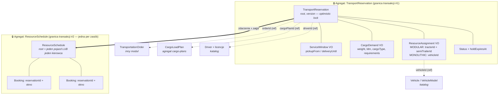
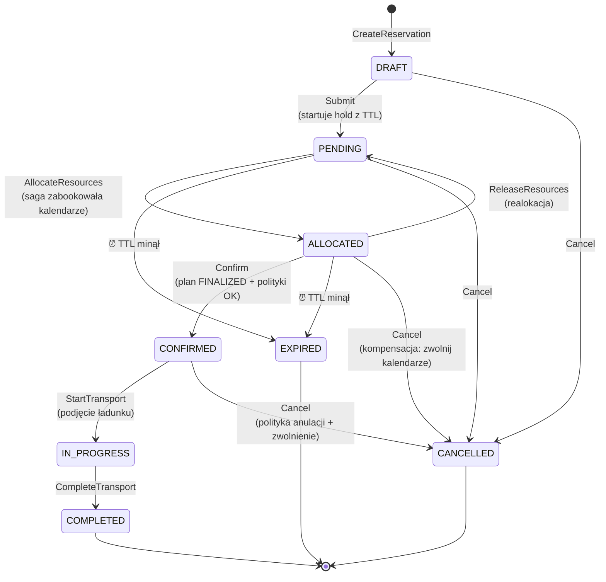
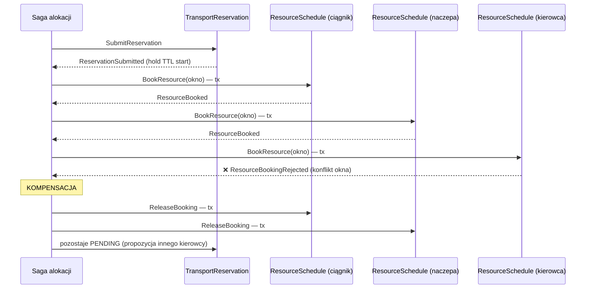

# Transport Reservation — projekt taktyczny (DDD)

> Moduł: **TMS / transport-reservation**. Dokument projektowy — bez kodu.
> Cel: uwidocznić **granice spójności**, **reguły** (i miejsce ich egzekwowania) oraz **stan** (cykl życia).

---

## 1. Problem biznesowy i język wszechobecny

Zamówienie transportowe (`TransportationOrder`) to **obietnica złożona klientowi**. Żeby ją zrealizować, trzeba **zarezerwować zdolność przewozową**: konkretny środek transportu (pojedynczy pojazd albo zestaw ciągnik+naczepa), kierowcę z odpowiednimi uprawnieniami oraz okno czasowe. Dziś w systemie tego brakuje — `PUT /transportation-orders/:id/driver` to TODO, a plan załadunku (`CargoLoadPlan`) żyje w oderwaniu od zasobów i czasu.

| Pojęcie | Znaczenie |
|---|---|
| **Rezerwacja transportu** (`TransportReservation`) | Roszczenie do zdolności przewozowej pod konkretne zamówienie: *co* wieziemy (profil ładunku), *kiedy* (okno serwisowe), *czym* (przydział zasobów), *kto prowadzi* (kierowca). |
| **Przydział zasobów** (`ResourceAssignment`) | Konkretny skład: dla klasy `MODULAR` — para ciągnik + naczepa; dla `MONOLITHIC` — pojedynczy van / box truck. |
| **Hold** | Tymczasowe zablokowanie zasobów z terminem ważności (TTL). Wygasa, jeśli rezerwacja nie zostanie potwierdzona. |
| **Kalendarz zasobu** (`ResourceSchedule`) | Oś czasu jednego zasobu (pojazdu lub kierowcy) z zajętymi oknami. Strażnik reguły „brak podwójnej rezerwacji”. |
| **Profil ładunku** (`CargoDemand`) | Migawka wymagań: waga, LDM, typ cargo, wymagania (chłodnia, ADR, security…). |

**Decyzja separacji:** rezerwacja to **osobny agregat**, nie rozszerzenie `TransportationOrder`. Inny cykl życia (zamówienie żyje od złożenia po dostawę i płatności; rezerwacja — od planowania po zakończenie przewozu), inny profil współbieżności (o zamówienie konkuruje klient i obsługa; o rezerwację — dyspozytorzy walczący o te same pojazdy), inne tempo zmian. Wiązanie: `orderId` jako referencja przez ID.

---

## 2. Granice spójności — mapa agregatów



**Co jest WEWNĄTRZ granicy `TransportReservation` (spójność silna, jedna transakcja):**
- status i legalność przejść,
- poprawność okna czasowego,
- kompletność przydziału względem klasy pojazdu,
- migawka profilu ładunku,
- TTL holdu.

**Co jest POZA granicą (referencja przez ID + spójność ostateczna):**
- `Vehicle`, `Driver`, `Customer`, `TransportationOrder`, `CargoLoadPlan` — **nigdy nie ładujemy ich do wnętrza agregatu**; walidujemy ich stan politykami w momencie decyzji (alokacja, potwierdzenie),
- zajętość zasobów w czasie — to inwariant **`ResourceSchedule`**, nie rezerwacji (patrz §4, decyzja D1).

**Dlaczego `ResourceSchedule` to osobny agregat?** Reguła „pojazd nie może mieć dwóch rezerwacji w nakładających się oknach” rozpina się na *wiele* rezerwacji — nie da się jej strzec z wnętrza jednej. Trzeba wyznaczyć obiekt, którego granica obejmuje wszystkie konkurujące zapisy: kalendarz **jednego** zasobu. Granica jest wąska celowo — dyspozytorzy rezerwujący *różne* pojazdy nie blokują się wzajemnie; konflikt (optimistic lock) powstaje tylko przy walce o **ten sam** zasób.

---

## 3. Stan — maszyna stanów rezerwacji



| Stan | Znaczenie | Zasoby | Modyfikowalność |
|---|---|---|---|
| `DRAFT` | Szkic dyspozytora | wolne | pełna |
| `PENDING` | Zgłoszona, czeka na przydział; **hold liczy TTL** | wolne | okno + profil ładunku |
| `ALLOCATED` | Zasoby zabookowane w kalendarzach, wciąż na holdzie | **zablokowane (hold)** | tylko realokacja / confirm / cancel |
| `CONFIRMED` | Wiążące zobowiązanie operacyjne | zablokowane na twardo | tylko cancel (z polityką) |
| `IN_PROGRESS` | Przewóz trwa | zajęte | brak (tylko complete) |
| `COMPLETED` / `CANCELLED` / `EXPIRED` | Terminalne | zwolnione | brak |

Stany terminalne + `holdExpiresAt` to świadome zapożyczenie z WMS (`storage_reservation`: PENDING/ACTIVE/EXPIRED/CANCELLED + `reserved_until`) — sprawdzony wzorzec „miękkiej blokady” zdolności.

---

## 4. Reguły — co, gdzie i z jaką spójnością

Kluczowa tabela projektu: **każda reguła ma przypisane miejsce egzekwowania**. Reguła bez adresu to reguła, której nie ma.

| # | Reguła | Wzorzec | Gdzie egzekwowana | Spójność |
|---|---|---|---|---|
| R1 | `pickupFrom < deliveryUntil`; okno nie w przeszłości przy submit | inwariant VO | konstruktor `ServiceWindow` | silna |
| R2 | Klasa `MODULAR` ⇒ przydział = dokładnie {TRACTOR_UNIT, SEMI_TRAILER}; `MONOLITHIC` ⇒ dokładnie jeden {VAN \| BOX_TRUCK} | inwariant agregatu | `TransportReservation.allocate()` | silna |
| R3 | Wyłącznie legalne przejścia stanów (§3) | inwariant agregatu | metody agregatu (`confirm()`, `cancel()`…) | silna |
| R4 | Po `CONFIRMED` niemutowalna (poza cancel/start/complete) | inwariant agregatu | guard w każdej metodzie | silna |
| R5 | **Zasób nie ma dwóch bookingów w nakładających się oknach** | inwariant **innego** agregatu | `ResourceSchedule.book()` + constraint DB (D1) | silna *w granicy zasobu* |
| R6 | Kierowca ma ważne w całym oknie uprawnienia do składu (C+E dla zestawu, C dla box trucka, B dla vana) | polityka domenowa | `DriverEligibilityPolicy` przy alokacji; **re-walidacja przy confirm** | ostateczna → silna w momencie decyzji |
| R7 | `carrier_type` planu załadunku zgodny z modelem przydzielonego pojazdu (np. `reefer` ⇔ naczepa `trailer_type='reefer'`; `van` ⇔ kind `VAN`) | polityka domenowa | `CarrierCompatibilityPolicy` przy alokacji i confirm | j.w. |
| R8 | Confirm tylko gdy `CargoLoadPlan.status = FINALIZED`, a `CargoDemand` mieści się w spec. przewoźnika | reguła między agregatami | application service przy `Confirm` (odczyt planu) | silna *w chwili* confirm |
| R9 | Dokumenty pojazdu (przegląd, ubezpieczenie) i licencja kierowcy ważne ≥ `deliveryUntil` | polityka domenowa | `ComplianceWindowPolicy` przy alokacji | ostateczna |
| R10 | Hold wygasa po TTL ⇒ `EXPIRED` + zwolnienie kalendarzy | polityka czasowa | scheduler → komenda `ExpireReservation` | ostateczna |
| R11 | Anulowanie zamówienia ⇒ anulowanie rezerwacji i zwolnienie zasobów | proces (saga/PM) | reakcja na `OrderCancelled` | ostateczna |
| R12 | Waga/LDM ładunku ≤ pojemność przewoźnika | inwariant **cudzego** agregatu | już istnieje w `CargoLoadPlan` — **nie duplikujemy** | silna (u źródła) |

**Zasada rozstrzygająca:** inwariant = reguła, która **nigdy** nie może być złamana i mieści się w jednej granicy transakcyjnej. Wszystko, co dotyka danych spoza granicy (licencje, dokumenty, stan planu), jest **polityką sprawdzaną w momencie podejmowania decyzji** — świat może się potem zmienić (licencja wygaśnie po confirm) i to obsługuje *proces* (alert, realokacja), a nie transakcja.

### D1 — decyzja: jak wymusić R5 (brak double-bookingu)?

| Opcja | Mechanizm | Ocena |
|---|---|---|
| A. Agregat `ResourceSchedule` | booking = wpis w kalendarzu zasobu; optimistic lock na kalendarzu | ✅ reguła **widoczna w modelu**; konflikt tylko przy walce o ten sam zasób |
| B. Sam constraint DB | `EXCLUDE USING gist (resource_id WITH =, tstzrange(from, until) WITH &&) WHERE status IN ('HOLD','CONFIRMED')` | ✅ szczelny, ale reguła „mieszka w bazie” — niewidoczna w domenie |
| C. Sama saga z kompensacją | rezerwuj optymistycznie, wycofaj przy konflikcie | ❌ okno wyścigu; kompensacje jako jedyna linia obrony |
| **Wybór: A + B** | model niesie regułę, baza jest pasem bezpieczeństwa (defense in depth) | — |

### D2 — decyzja: `CargoDemand` jako migawka, nie referencja

Rezerwacja kopiuje profil ładunku w chwili submit. Zamówienie może się później zmieniać — rezerwacja musi wiedzieć, **na co dokładnie** zablokowała zasoby. Rozjazd migawki z zamówieniem wykrywa proces (zdarzenie `OrderItemsChanged` → flaga „wymaga rewizji”), a nie współdzielony stan.

---

## 5. Komendy → zdarzenia

| Komenda (intencja) | Agregat | Zdarzenie domenowe | Kto nasłuchuje |
|---|---|---|---|
| `CreateReservation` | TransportReservation | `TransportReservationCreated` | read model |
| `SubmitReservation` | TransportReservation | `ReservationSubmitted` | saga alokacji |
| `BookResource` | ResourceSchedule | `ResourceBooked` / `ResourceBookingRejected` | saga alokacji |
| `AllocateResources` | TransportReservation | `ResourcesAllocated` | read model, notyfikacje |
| `ReleaseBooking` | ResourceSchedule | `ResourceBookingReleased` | read model kalendarza |
| `ConfirmReservation` | TransportReservation | `ReservationConfirmed` | moduł zamówień (timeline: `PREPARING_SHIPMENT`), notyfikacje |
| `StartTransport` | TransportReservation | `TransportStarted` | zamówienia (timeline: `IN_TRANSIT`) |
| `CompleteTransport` | TransportReservation | `TransportCompleted` | zamówienia (timeline: `DELIVERED`) |
| `CancelReservation` | TransportReservation | `ReservationCancelled` | saga (kompensacja bookingów) |
| `ExpireReservation` *(system)* | TransportReservation | `ReservationExpired` | saga (zwolnienie), notyfikacje |

Zdarzenia rezerwacji zasilają `order_timeline_events` — istniejący, niejawny strumień zdarzeń zamówienia dostaje wreszcie prawdziwe źródło.

---

## 6. Proces: saga alokacji zasobów

Alokacja dotyka **trzech granic transakcyjnych** (rezerwacja + kalendarz pojazdu/-ów + kalendarz kierowcy) — z definicji nie może być jedną transakcją. To saga z kompensacją:



Ścieżka szczęśliwa kończy się `AllocateResources` na rezerwacji (przejście `PENDING → ALLOCATED`). Każdy booking niesie `reservationId` — kompensacja i wygaszanie po TTL są idempotentne (zwolnij *bookingi tej rezerwacji*, nie „ostatnie”).

Drugi proces: **wygaszanie holdów** (R10) — cykliczna polityka znajduje rezerwacje `PENDING/ALLOCATED` z `holdExpiresAt < now`, wysyła `ExpireReservation`, saga zwalnia kalendarze.

Trzeci: **reakcja na otoczenie** — `OrderCancelled` → `CancelReservation`; `DriverLicenseExpired` / `VehicleDocumentExpired` w oknie potwierdzonej rezerwacji → alert + propozycja realokacji (nie automatyczna anulacja — decyzja dyspozytora).

---

## 7. Elementy taktyczne — zestawienie

| Element | Wzorzec | Uwagi (spójne z istniejącym kodem cargo-plans) |
|---|---|---|
| `TransportReservation` | **Aggregate Root** | `UUID<'TransportReservation'>`, pole `version` (optimistic lock), metody zwracają `Result<T, DomainError>` |
| `ResourceSchedule` | **Aggregate Root** | root per zasób: `resourceType` (VEHICLE \| DRIVER) + `resourceId`; kolekcja `Booking` |
| `ServiceWindow` | **Value Object** | niezmienniczy; operacja `overlaps(other)` — używana przez kalendarz |
| `CargoDemand` | **Value Object** | reużywa `Weight` (shared VO) i `CargoRequirements` z cargo-plans |
| `ResourceAssignment` | **Value Object** | wariantowy: `ModularAssignment` \| `MonolithicAssignment` — R2 niewyrażalna inaczej niż typem |
| `Booking` | **encja wewnątrz** `ResourceSchedule` | tożsamość lokalna; nie wychodzi poza granicę |
| `DriverEligibilityPolicy`, `CarrierCompatibilityPolicy`, `ComplianceWindowPolicy` | **Domain Service / Policy** | czyste funkcje: (rezerwacja, dane zasobu) → `Result`; dane dostarcza application service |
| Saga alokacji | **Process Manager** | stan procesu trwały; kompensacje idempotentne |
| `TransportReservationRepository`, `ResourceScheduleRepository` | **Repository** | wzorem `SqlCargoLoadPlanRepository`; `OptimisticLockError` przy konflikcie wersji |
| `ReservationReadModel`, `ResourceCalendarReadModel` | **Read Model** | listing rezerwacji; kalendarz obłożenia floty (zapytanie „wolne pojazdy w oknie X” to **odczyt**, nie obowiązek agregatu) |
| Zdarzenia z §5 | **Domain Event** | publikacja po commicie (outbox — poza zakresem tego dokumentu) |

**Czego świadomie NIE robimy:**
- nie wchłaniamy `CargoLoadPlan` do rezerwacji — pojemność/kompatybilność ładunku to jego inwarianty (R12); rezerwacja trzyma tylko `cargoPlanId` i pyta o status,
- nie modelujemy „dostępności pojazdu” jako pola na `Vehicle` (`status='reserved'`) — dostępność jest **funkcją czasu**, nie atrybutem; stąd kalendarz,
- nie budujemy jednego wielkiego agregatu `FleetSchedule` (kalendarz całej floty) — zabiłby współbieżność: każda rezerwacja czegokolwiek konfliktowałaby z każdą inną.

---

## 8. Szkic persystencji (informacyjnie — nie kodujemy)

```
tms_reservations.transport_reservations
  id UUID PK, order_id INT, cargo_plan_id UUID NULL,
  status TEXT CHECK (DRAFT|PENDING|ALLOCATED|CONFIRMED|IN_PROGRESS|COMPLETED|CANCELLED|EXPIRED),
  pickup_from TIMESTAMPTZ, delivery_until TIMESTAMPTZ,
  cargo_demand JSONB,             -- migawka (D2)
  assignment JSONB NULL,          -- wariant MODULAR/MONOLITHIC
  driver_id INT NULL,
  hold_expires_at TIMESTAMPTZ NULL,
  version INT NOT NULL DEFAULT 0  -- optimistic lock

tms_reservations.resource_bookings   -- projekcja agregatu ResourceSchedule
  id UUID PK, resource_type TEXT, resource_id INT,
  reservation_id UUID, booked_from TIMESTAMPTZ, booked_until TIMESTAMPTZ,
  state TEXT CHECK (HOLD|CONFIRMED|RELEASED),
  EXCLUDE USING gist (
    resource_type WITH =, resource_id WITH =,
    tstzrange(booked_from, booked_until) WITH &&
  ) WHERE (state IN ('HOLD','CONFIRMED'))   -- pas bezpieczeństwa dla R5 (D1)
```

---

## 9. Otwarte pytania (do rozstrzygnięcia z biznesem)

1. **TTL holdu** — ile? (WMS nie precyzuje; propozycja startowa: 48 h od submit, odnawialny raz).
2. Czy `CONFIRMED` można anulować bezkosztowo, czy obowiązuje polityka okien anulacyjnych (np. < 24 h przed `pickupFrom` wymaga zgody przełożonego)?
3. Czy jedna rezerwacja może obsługiwać wiele zamówień (konsolidacja LTL)? Obecny projekt: 1 rezerwacja ↔ 1 zamówienie; konsolidacja zmieniłaby kardynalność `orderId` → `orderIds[]` i regułę R8.
4. Serwis/przeglądy pojazdów — czy planowane przestoje też są bookingami w `ResourceSchedule` (rekomendacja: tak, z `bookingType=MAINTENANCE` — jeden strażnik osi czasu)?
