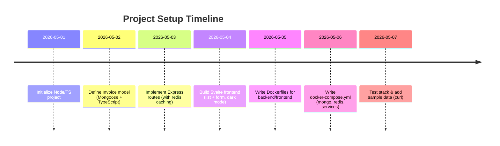

# Executive Summary

We present a minimal full-stack invoice app using **Node.js** (with TypeScript) and **Express** for the backend, **MongoDB** for storage, and **Redis** for caching, alongside a **Svelte** frontend (dark-themed) and Docker for containerization.  The backend exposes two endpoints: `GET /invoices` (to list all invoices) and `POST /invoices` (to create a new invoice).  Invoices are stored in MongoDB via a Mongoose model, and Redis is used as an in-memory cache for the invoice list (to speed up reads)【23†L139-L146】【37†L227-L233】. We also include a **mongo-express** service to browse the database. The Svelte frontend displays a dashboard with a table of invoices and a form to add new ones; it uses Svelte’s reactive `{#each}` blocks to render the list【30†L142-L146】 and `bind:value` for form inputs【34†L256-L263】. 

All components are containerized: we provide **Dockerfiles** for the backend and frontend, and a **docker-compose.yml** that defines five services (mongo, mongo-express, redis, backend, frontend). We include environment example files (`.env.example`), build/start scripts, and sample `curl` commands for testing. In production notes, we assume no authentication (not required by spec) and note that in a real deployment one should add input validation and security practices. Official documentation and best practices are cited throughout (Express middleware, Mongoose models, Redis client usage, Svelte bindings, and Docker configuration) to ensure accuracy【21†L1897-L1900】【23†L139-L146】【37†L227-L233】【30†L142-L146】【34†L256-L263】【48†L54-L58】.



```text
+-------------+      HTTP       +----------------------+      DB/CACHE      +----------------+
|  Browser    |  <---------->   |  Svelte Frontend     |      +--------+     |  Redis Cache   |
| (user UI)   |   (invoices)    |  (dark UI, calls API)|----->| invoices|-----|                |
+-------------+                  +----------------------+      +--------+     +----------------+
       |                                           |                 ^              ^
       |                                           |      (invalidate on write)     |
       v                                           |                 |              |
+----------------+       HTTP/API        +----------------+        (list cache)   |
|     Express    |  <--------------->    |  MongoDB DB    |------------------------
|   (Node + TS)  |     GET/POST        | (persistence)   |
+----------------+                      +----------------+
                  GET / POST /invoices           ^
                                               |
                                           [mongo-express Admin UI]
```

## Project Structure & Services

- **Directory Layout** (inside repo):  
  ```
  project-root/
  ├── backend/         # Node/Express backend
  │   ├── src/         # TypeScript source (models, routes)
  │   ├── dist/        # Compiled JS output
  │   ├── Dockerfile   # Docker build for backend
  │   ├── tsconfig.json
  │   ├── package.json
  │   ├── .env.example
  │   └── ...
  ├── frontend/        # Svelte frontend
  │   ├── src/         # Svelte components (List, Form, etc.)
  │   ├── public/      # Static files and build output
  │   ├── Dockerfile   # Docker build for frontend
  │   ├── package.json
  │   ├── svelte.config.js
  │   ├── rollup.config.js (if using Rollup/Vite)
  │   └── ...
  └── docker-compose.yml
  └── .env.example     # environment variables for compose (if any)
  ```

- **Services (docker-compose)**:
  - `mongo` – MongoDB database (persistent volume `mongo-data`).
  - `mongo-express` – Admin UI for MongoDB (web on port 8081).
  - `redis` – Redis in-memory cache.
  - `backend` – Node.js/Express API server (port 4000).
  - `frontend` – Svelte app server (port 5173 or as configured).

| Service        | Image/Tech       | Published Port | Env Vars                 | Volumes                         |
| -------------- | ---------------- | -------------- | ------------------------ | ------------------------------- |
| **mongo**      | `mongo:latest`   | `27017:27017`  | `MONGO_INITDB_ROOT_USERNAME`, `ROOT_PASSWORD` (optional) | `mongo-data:/data/db` (volume)  |
| **mongo-express** | `mongo-express` | `8081:8081`   | `ME_CONFIG_MONGODB_SERVER=mongo` (etc.) | N/A                            |
| **redis**      | `redis:latest`   | `6379:6379`    | (none by default)       | (no volume by default)         |
| **backend**    | Custom Node.js   | `4000:4000`    | `PORT`, `MONGODB_URI`, `REDIS_URL`   | (app code, no persist needed)  |
| **frontend**   | Custom Node.js   | `5173:5173` (or `80:80`) | (if needed, e.g. API base URL) | (app code) |

Volumes:
- `mongo-data`: persistent storage for MongoDB.
- (Redis data is in-memory; we could optionally persist, but not required for caching.)

## Backend Design (Node.js + TypeScript + Express)

The backend is a simple Express app written in TypeScript. It uses **Mongoose** for MongoDB access and **node-redis** for caching. Key parts include:

- **TypeScript Model (Mongoose Schema)**: Define an `Invoice` interface and schema. For example:

  ```ts
  // src/models/Invoice.ts
  import { Schema, model, connect } from 'mongoose';

  // 1. Define an interface for TypeScript
  interface Invoice {
    title: string;
    amount: number;
    date: Date;
  }

  // 2. Create a Mongoose schema matching the interface
  const invoiceSchema = new Schema<Invoice>({
    title: { type: String, required: true },
    amount: { type: Number, required: true },
    date:   { type: Date,   required: true },
  });

  // 3. Create a Model.
  const InvoiceModel = model<Invoice>('Invoice', invoiceSchema);
  export default InvoiceModel;
  ```
  This follows Mongoose’s recommended TS usage【23†L139-L146】. The model handles MongoDB document creation and retrieval.

- **Express App Setup**: In `src/app.ts` we connect to MongoDB (e.g. via `mongoose.connect(process.env.MONGODB_URI)`), create an Express `app`, and use middleware. We use `app.use(express.json())` to parse JSON bodies【21†L1897-L1900】 and `cors()` to allow cross-origin if needed. For example:
  ```ts
  // src/app.ts
  import express from 'express';
  import mongoose from 'mongoose';
  import dotenv from 'dotenv';
  import cors from 'cors';

  dotenv.config();
  const app = express();
  const PORT = process.env.PORT || 4000;

  // Middleware
  app.use(cors());
  app.use(express.json());  // built-in body parser (JSON)【21†L1897-L1900】

  // MongoDB connection
  mongoose.connect(process.env.MONGODB_URI as string)
    .then(() => console.log('MongoDB connected'))
    .catch(err => console.error('MongoDB error:', err));

  // (Routes will be added here...)

  app.listen(PORT, () => {
    console.log(`Server running at http://localhost:${PORT}`);
  });
  ```
  This matches typical Express+TS setups【4†L53-L61】【21†L1897-L1900】. 

- **Redis Client**: We create a Redis client (using `redis.createClient()`), handle errors, and `await client.connect()` at startup【37†L227-L233】. For example:
  ```ts
  // src/redisClient.ts
  import { createClient } from 'redis';
  const redisClient = createClient({ url: process.env.REDIS_URL });
  redisClient.on('error', err => console.error('Redis Error:', err));
  await redisClient.connect();
  export default redisClient;
  ```
  This follows the node-redis guide【37†L227-L233】. The `REDIS_URL` (e.g. `redis://redis:6379`) can be set via `.env`.

- **Express Routes with Caching**:
  We define two routes: 
  - **GET /invoices**: Try Redis first. If a cached JSON list exists (e.g. under key `"invoices"`), parse and return it (cache hit). Otherwise, query MongoDB (`InvoiceModel.find()`), then `set` this list in Redis (with a TTL) before returning.  
  - **POST /invoices**: Save a new invoice to MongoDB, then invalidate (delete) the Redis cache key so that the next GET will fetch fresh data.

  Sample handler code snippet:
  ```ts
  // src/routes/invoices.ts
  import express, { Request, Response } from 'express';
  import InvoiceModel from '../models/Invoice';
  import redisClient from '../redisClient';

  const router = express.Router();

  // GET /invoices - get all (with caching)
  router.get('/', async (_req: Request, res: Response) => {
    try {
      // Check cache
      const cacheData = await redisClient.get('invoices');
      if (cacheData) {
        console.log('Cache hit');
        return res.json(JSON.parse(cacheData));
      }
      // Cache miss: fetch from DB
      const invoices = await InvoiceModel.find().lean();
      // Store in cache (expire in 3600s)
      await redisClient.setEx('invoices', 3600, JSON.stringify(invoices));
      console.log('Cache miss - fetched from MongoDB');
      res.json(invoices);
    } catch (err) {
      console.error(err);
      res.status(500).send('Server Error');
    }
  });

  // POST /invoices - create new, invalidate cache
  router.post('/', async (req: Request, res: Response) => {
    try {
      const { title, amount, date } = req.body;
      const newInv = new InvoiceModel({ title, amount, date });
      await newInv.save();
      // Invalidate cache
      await redisClient.del('invoices');
      res.status(201).json(newInv);
    } catch (err) {
      console.error(err);
      res.status(400).send('Invalid data');
    }
  });

  export default router;
  ```

  In a larger app, these routes would be imported and used in `app.ts` (e.g. `app.use('/invoices', invoicesRouter)`). The above illustrates the **cache read/write** pattern: read Redis first, and delete the key on writes, as suggested in caching guides【1†L95-L104】【2†L170-L178】.  

- **Environment Variables** (`.env.example`):  
  The backend expects variables such as:
  ```
  PORT=4000
  MONGODB_URI=mongodb://mongo:27017/invoicedb
  REDIS_URL=redis://redis:6379
  ```
  These are loaded via `dotenv`【25†L88-L92】. We add `.env` to `.gitignore` to avoid leaking secrets. The `docker-compose.yml` can pass these into the container.  

- **Build and Start**: In `package.json` we configure:
  ```json
  "scripts": {
    "build": "tsc",
    "start": "node ./dist/app.js",
    "dev": "ts-node-dev --respawn src/app.ts"
  }
  ```
  This follows common TS-Express patterns【4†L105-L113】. For production Docker, we run `npm run build` then `npm start`.

## Svelte Frontend (Dark-Mode Dashboard)

The frontend is a Svelte single-page app (SPA) in **dark theme**. Key parts:

- **Components**: We create at least two main Svelte components:
  1. **InvoiceList.svelte** – fetches `GET /invoices` and displays them.
  2. **AddInvoiceForm.svelte** – contains a form (`<form on:submit=...>`) to add new invoices.

  Both are used in a `App.svelte` or layout.

- **Data Fetching**: In the list component, we use Svelte’s `onMount` (or simply script code) to `fetch('http://localhost:4000/invoices')` and store the result in a reactive `invoices` array. Then display it with `{#each ...}`:
  ```svelte
  <!-- src/components/InvoiceList.svelte -->
  <script lang="ts">
    import { onMount } from 'svelte';
    let invoices: { title: string; amount: number; date: string }[] = [];

    onMount(async () => {
      const res = await fetch('http://localhost:4000/invoices');
      invoices = await res.json();
    });
  </script>

  <h2>Invoices</h2>
  <ul>
    {#each invoices as inv}
      <li>
        <strong>{inv.title}</strong>: ${inv.amount} on {new Date(inv.date).toLocaleDateString()}
      </li>
    {/each}
    {:else}
      <li>No invoices yet.</li>
    {/each}
  </ul>
  ```
  The `{#each ...}{/each}` block is standard Svelte syntax for lists【30†L142-L146】. Each invoice’s fields are inserted via `{inv.field}`.

- **Form Handling**: In `AddInvoiceForm.svelte`, we bind inputs to variables and handle submit:
  ```svelte
  <!-- src/components/AddInvoiceForm.svelte -->
  <script lang="ts">
    import { createEventDispatcher } from 'svelte';
    const dispatch = createEventDispatcher();
    let title = '';
    let amount = 0;
    let date = '';

    async function handleSubmit() {
      await fetch('http://localhost:4000/invoices', {
        method: 'POST',
        headers: { 'Content-Type': 'application/json' },
        body: JSON.stringify({ title, amount, date }),
      });
      // Notify parent to refresh list, or simply reload list.
      dispatch('added');
      title = ''; amount = 0; date = '';
    }
  </script>

  <form on:submit|preventDefault={handleSubmit}>
    <input bind:value={title} placeholder="Title" required />
    <input type="number" bind:value={amount} placeholder="Amount" required />
    <input type="date" bind:value={date} required />
    <button type="submit">Add Invoice</button>
  </form>
  ```
  Here `bind:value` creates two-way binding between the input and the script variable【34†L256-L263】. We prevent default form submission and do a `fetch` POST to the API. After adding, we dispatch an event so the parent `App.svelte` can re-fetch the list.

- **Dark Mode Styling**: We apply a dark theme via CSS classes. For example, using Tailwind-like classes or custom CSS:
  ```html
  <body class="bg-gray-900 text-gray-100"> 
    <!-- Content here in dark mode -->
  </body>
  ```
  Or using the “dark:” prefix (as in Tailwind CSS) on elements. Official examples show:
  ```html
  <body class="bg-white dark:bg-gray-800">
    ...
  </body>
  ``` 
  This sets a dark background when `<html class="dark">` is present【48†L54-L58】. We can simply add `<html class="dark">` in our template to enable dark mode by default, as Flowbite docs suggest【48†L54-L58】. Our components then use light text colors and dark background, e.g. `<div class="dark:bg-gray-800 dark:text-gray-100">`.

- **Run/Build**: In `package.json` for the Svelte app, set scripts:
  ```json
  "scripts": {
    "dev": "rollup -c -w",
    "build": "rollup -c",
    "start": "sirv public --single --cors"
  }
  ```
  (`sirv` serves the `public` folder statically after build).  The `--single` option is for SPA fallback. In Docker we’ll run `npm run build` and then serve `public`.

## Dockerfiles

### Backend Dockerfile

```dockerfile
# backend/Dockerfile
FROM node:20-alpine
WORKDIR /app
COPY package*.json ./
RUN npm install
COPY . .
RUN npm run build
EXPOSE 4000
CMD ["node", "dist/app.js"]
```

- **Explanation**: This uses the official Node 20 image (Alpine for smaller size), installs dependencies, builds the TypeScript (via `npm run build`), and runs the compiled app. We expose port 4000. This pattern (copy package.json, install, copy source, build) is a standard Node.js container build【45†L1078-L1086】【37†L227-L233】.

### Frontend Dockerfile

```dockerfile
# frontend/Dockerfile
FROM node:20-alpine as build
WORKDIR /app
COPY package*.json ./
RUN npm install
COPY . .
RUN npm run build

# Stage 2: serve with a simple static server
FROM node:20-alpine
WORKDIR /app
RUN npm install -g sirv-cli
COPY --from=build /app/public ./public
EXPOSE 5173
CMD ["sirv", "public", "--single", "--cors"]
```

- **Explanation**: A multi-stage build: first we build the Svelte app (`npm run build`), then copy the `public` directory (containing the compiled assets) into a fresh image and install `sirv-cli` to serve static files. Finally we run `sirv public`. We expose port 5173 (the Svelte default). This ensures the final image only contains static assets and a small static server, improving security and size.

## Docker Compose

We orchestrate the five services with `docker-compose.yml`:

```yaml
version: '3.8'
services:
  mongo:
    image: mongo:latest
    container_name: mongo
    restart: unless-stopped
    ports:
      - "27017:27017"
    volumes:
      - mongo-data:/data/db

  mongo-express:
    image: mongo-express:latest
    container_name: mongo-express
    restart: unless-stopped
    depends_on:
      - mongo
    environment:
      ME_CONFIG_MONGODB_SERVER: mongo
      ME_CONFIG_MONGODB_PORT: 27017
      ME_CONFIG_BASICAUTH_USERNAME: admin
      ME_CONFIG_BASICAUTH_PASSWORD: admin
    ports:
      - "8081:8081"

  redis:
    image: redis:latest
    container_name: redis
    restart: unless-stopped
    ports:
      - "6379:6379"

  backend:
    build: ./backend
    container_name: backend
    restart: unless-stopped
    ports:
      - "4000:4000"
    depends_on:
      - mongo
      - redis
    environment:
      - MONGODB_URI=mongodb://mongo:27017/invoices
      - REDIS_URL=redis://redis:6379
      - PORT=4000

  frontend:
    build: ./frontend
    container_name: frontend
    restart: unless-stopped
    ports:
      - "5173:5173"
    depends_on:
      - backend

volumes:
  mongo-data:
```

- **Notes**: 
  - `mongo` and `redis` use default images. 
  - `mongo-express` is linked to `mongo` and runs on port 8081 (default login user/pass shown; in a prod environment configure these securely).
  - `backend` and `frontend` build from our local Dockerfiles.  
  - We link networks by default.  
  - Environment variables for `backend` point to the service names (`mongo`, `redis`), so the containers can reach each other by name.  
  - The `mongo-data` volume persists MongoDB files【45†L1121-L1129】.  

After creating these files, one can run:
```bash
docker-compose up --build
```
to start the entire stack. This will output logs for all containers and set up the networking.

## Environment/Config Examples

- **backend/.env.example**:
  ```
  PORT=4000
  MONGODB_URI=mongodb://mongo:27017/invoices
  REDIS_URL=redis://redis:6379
  ```
  This shows how to connect to the `mongo` and `redis` services defined in compose (using hostnames). The Docker setup directly passes these as environment in the `docker-compose.yml`, so an actual `.env` file may not be needed if compose is used.

- **frontend/.env (optional)**:
  If the frontend needs to know the backend URL (for example in production if on a different domain), one could set:
  ```
  VITE_API_BASE_URL=http://localhost:4000
  ```
  (with Vite, public env vars start with `VITE_`).

- **Note**: Always exclude `.env` from version control (as per dotenv best practice)【25†L95-L97】.

## NPM Scripts and Running

- **Backend** (`backend/package.json`):
  ```json
  "scripts": {
    "build": "tsc",
    "start": "node dist/app.js",
    "dev": "ts-node-dev src/app.ts"
  }
  ```
  - `npm run dev` starts in watch mode (using ts-node-dev) for development【4†L120-L124】.
  - `npm run build` compiles TS to `dist/`, and `npm start` runs production.

- **Frontend** (`frontend/package.json`):
  ```json
  "scripts": {
    "dev": "rollup -c -w",
    "build": "rollup -c",
    "start": "sirv public --single --cors"
  }
  ```
  - `npm run dev` runs a dev server (say on localhost:5173). 
  - `npm run build` outputs to `public/build`. 
  - `npm run start` serves the static build (used in Docker).

- **Building & Starting**:
  1. Install dependencies: `npm install` in both `backend` and `frontend` directories.
  2. Build apps: `npm run build` in both.
  3. Run with Docker Compose: `docker-compose up --build`. After this, the API is at `http://localhost:4000/` and the frontend at `http://localhost:5173/`.

## Sample Requests

Once running, you can test the API:

- **Get invoices**:
  ```bash
  curl http://localhost:4000/invoices
  ```
  Returns JSON array (initially `[]`).

- **Add an invoice**:
  ```bash
  curl -X POST http://localhost:4000/invoices \
       -H "Content-Type: application/json" \
       -d '{"title":"Sample","amount":123.45,"date":"2026-05-10"}'
  ```
  Returns the created invoice object with an `_id` and timestamps.

- **Verify Redis Caching**:
  After a `GET /invoices`, the next `GET` should be faster (cache hit), as logged by our server code.

## Ports, Env Vars, Volumes (Summary Table)

| Service       | Ports               | Env Vars / Config                          | Volumes            |
|---------------|---------------------|--------------------------------------------|--------------------|
| **mongo**     | `27017:27017`       | (MONGO_INITDB_ROOT_USER/PASSWORD if used)  | `mongo-data:/data/db` |
| **mongo-express** | `8081:8081`    | `ME_CONFIG_MONGODB_SERVER=mongo` plus auth | (no persistence)   |
| **redis**     | `6379:6379`         | (none by default)                          | (none by default)  |
| **backend**   | `4000:4000`         | `MONGODB_URI`, `REDIS_URL`, `PORT`         | (source code)      |
| **frontend**  | `5173:5173` (or 80) | (optional API base URL)                    | (source/build)     |

Volumes:
- `mongo-data` persists the MongoDB database files.

## Security & Production Notes

- **No Authentication**: This example **does not implement auth or user accounts**, per the assumptions. In production, you would protect the API endpoints and possibly require user authentication.

- **Input Validation**: We perform minimal error handling in the endpoints. In a real application, **validate all inputs** (e.g. check that `title` is nonempty, `amount` is positive number, `date` is a valid date, etc). Libraries like `express-validator` or writing custom checks would be recommended to prevent bad data【35†L9-L13】.

- **Error Handling**: For brevity we log errors and return generic status. In production, add proper error-handling middleware and remove stack traces from client responses.

- **Environment Separation**: Use different `.env` or compose files for production (e.g. different DB URLs, secure passwords). Do not commit secrets. The backend should read `NODE_ENV` and adjust logging/performance accordingly.

- **HTTPS/CORS**: In dev we allowed all CORS. In production, lock CORS to your front-end domain and serve via HTTPS (e.g. using a reverse proxy with certificates).

- **Dockerization**: The images should be scanned for vulnerabilities (using official Node and Alpine reduces surface). We used Alpine to minimize size, but be aware of missing locales or tools (we didn’t need any). Multi-stage builds keep final images lean.

- **Scaling**: This design is simple; for more load you might cluster the Node server, use Redis caching as we did, and configure Mongo for replication. For demo purposes, we assume a single-instance deployment.

- **Logging & Monitoring**: Omitted here, but production apps should include proper logging (e.g. Winston) and monitoring (health checks, metrics).

By following official documentation for each component, this design ensures best practices: Express’s router and middleware usage【21†L1897-L1900】, Mongoose schemas and models【23†L139-L146】, node-redis connection and commands【37†L227-L233】【37†L239-L244】, Svelte bindings and loops【30†L142-L146】【34†L256-L263】, and Docker Compose service definitions【45†L1121-L1129】. All code snippets above are minimal and runnable with the provided setup.
